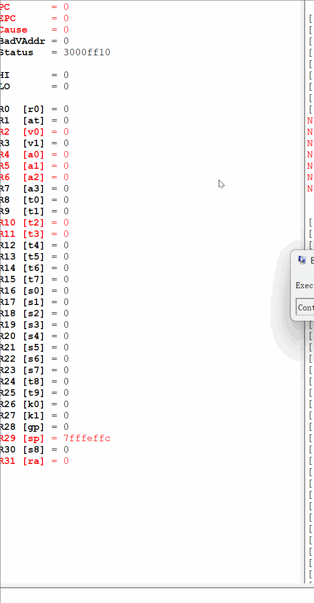
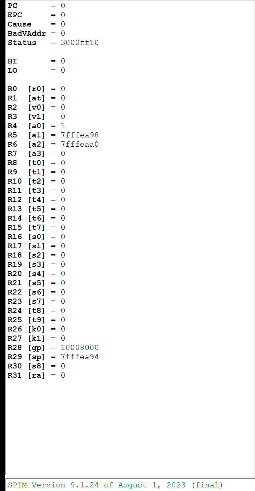
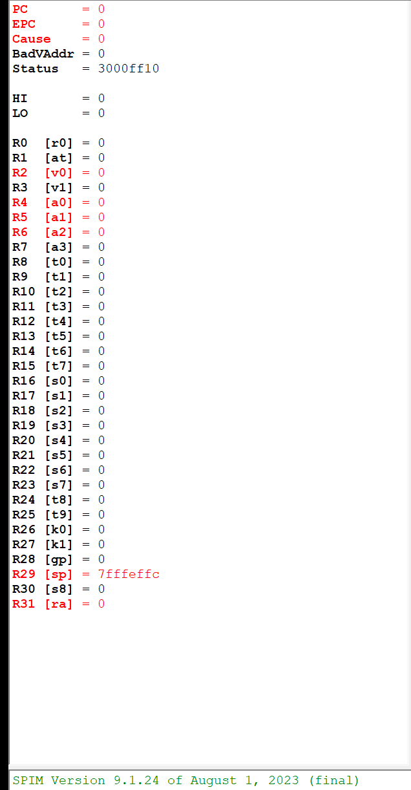
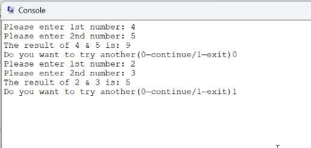
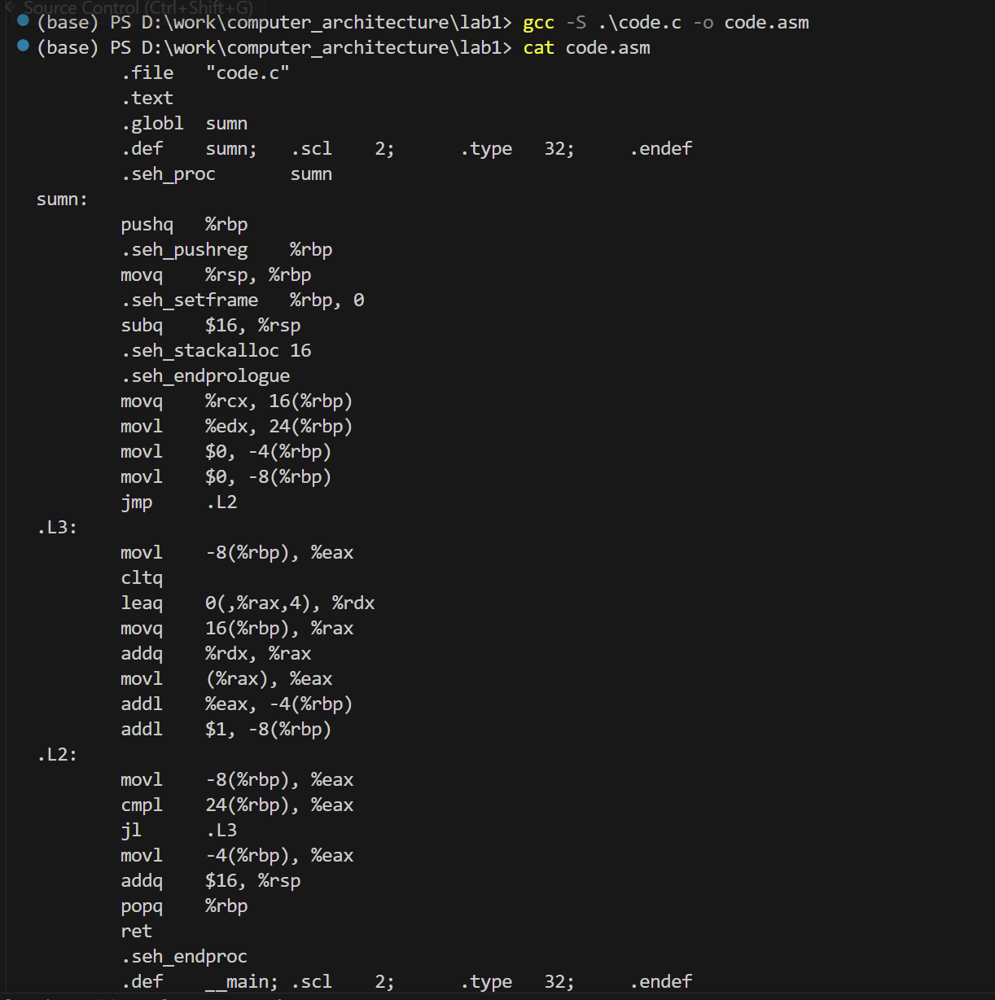
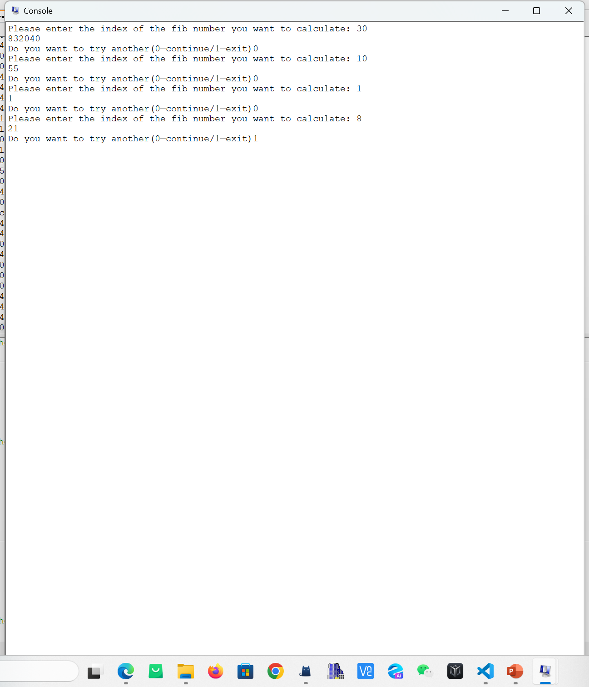

## 实验 1：MIPS 程序设计

实验时间：
实验人员：张子程 23307140019
指导老师：

### 1 实验目的

### 2 实验过程

#### 2.2







#### 2.3

##### 2.3.1 实验设计

用系统调用 read integer 读取用户输入，print integer 和 print string 完成输出。基本汇编指令 add，move，beq 等实现逻辑。提示词常量字符串存在 data 段。

##### 2.3.2 部分实验代码

```
#code snippet for printing string and reading int
la $a0, quest1_msg
li $v0, 4
syscall
li $v0, 5 # load syscall read_int into $v0.
syscall
move $t2, $v0

。。。

#code snippet for looping
li $v0, 5 # load syscall read_int into $v0
syscall # make the syscall
move $t2, $v0 # move v0 to t2
beq $0 $t2 main # if t2=1 branch back to main(restart) else let it go and end program

。。。
```

##### 2.3.3 实验结果



#### 2.4

##### 2.4.1 实验设计

用 gcc 完成 c 代码到汇编代码的

##### 2.4.2 实验结果



#### 2.5



### 3 实验结论

### 4 实验感想
