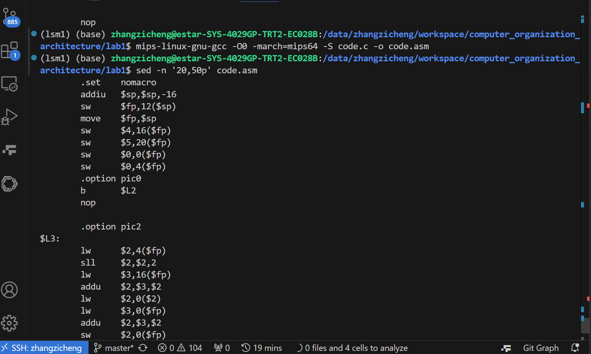
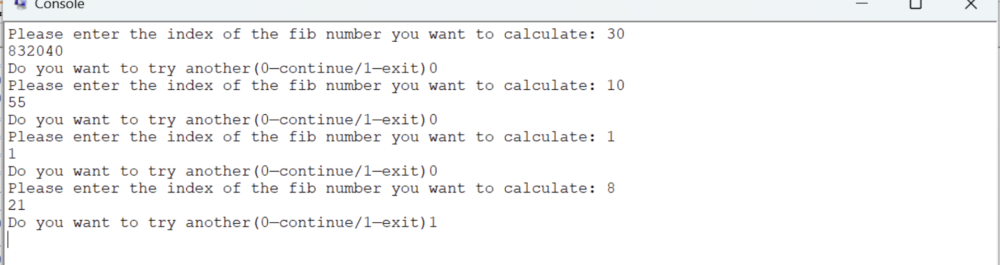

## 实验 1：MIPS 程序设计

实验时间：
实验人员：张子程 23307140019
指导老师：

### 1 实验目的

### 2 实验过程

#### 2.2

以下都是动图：


- **程序功能**：计算 `40 + 17`，结果保存到寄存器 `$t3` 中。
- **关键指令**：
  - `ori $t2, $0, 40`：将 `$t2` 初始化为 **40**（`$0` 恒为 0，逻辑或后值不变）。
  - `ori $t3, $0, 17`：将 `$t3` 初始化为 **17**。
  - `add $t3, $t2, $t3`：执行加法运算，结果 `57` 存入 `$t3`。
- **特殊寄存器**：
  - `ori $0, $0, 40`：试图修改 **恒零寄存器 `$0`** 无效（值仍为 0）。
  - `ori $t4, $0, 0`：将 `$t4` 设为 `$0` 的值（即 **0**，而非 40）。
- **退出逻辑**：
  - `ori $v0, $0, 10`：设置系统调用号 **10**（`exit`）。
  - `syscall`：触发系统调用，**终止程序**。


- **程序功能**：加载 **32 位立即数** 到寄存器，并退出程序。
- **关键指令**：
  - `ori $t2, $0, 40`：初始 `$t2` 为 **40**（`$0` 恒为 0）。
  - `lui $t2, 0x1234`：将 `$t2` 高 16 位设为 **0x1234**，低 16 位清零（值变为 `0x12340000`）。
  - `ori $t2, $t2, 40`：合并低 16 位为 **40**（十六进制 `0x28`），最终 `$t2 = 0x12340028`。
  - `li $t3, 0x12340028`：伪指令，等价于 `lui` + `ori`，直接加载 **0x12340028** 到 `$t3`。
- **寄存器变化**：
  - `$t2` 值变化：`40 → 0x12340000 → 0x12340028`。
  - `$t3` 被直接赋值为 **0x12340028**。
- **退出逻辑**：
  - `li $v0, 10`：设置系统调用号 **10**（`exit`）。
  - `syscall`：触发系统调用，**终止程序**。


- **程序功能**：实现内存数据加载、计算并存储结果，最终退出程序。
- **核心逻辑**：
  - `la $t0, h`：将符号 `h` 的 **内存地址** 加载到 `$t0`（`h` 需在数据段定义）。
  - `la $t1, A`：将数组 `A` 的 **首地址** 加载到 `$t1`。
  - `lw $t2, 0($t0)`：从 `$t0` 地址读取 **字数据**（即 `h` 的值）到 `$t2`。
  - `lw $t3, 32($t1)`：访问数组 `A[8]`（偏移量 `32 = 8 × 4 字节`），值存入 `$t3`。
  - `add $t3, $t2, $t3`：计算 `h + A[8]`，结果存入 `$t3`。
  - `sw $t3, 48($t1)`：将计算结果存入 `A[12]`（偏移量 `48 = 12 × 4 字节`）。
- **内存操作细节**：
  - **`la` 伪指令**：实际由 `lui`（高 16 位）和 `ori`（低 16 位）组合实现地址加载。
  - **数组索引计算**：MIPS 中字（4 字节）寻址，`A[i]` 的偏移量为 `i × 4`。
- **退出逻辑**：
  - `li $v0, 10`：设置系统调用号 `10`（`exit`）。
  - `syscall`：终止程序执行。

#### 2.3

##### 2.3.1 实验设计

用系统调用 read integer 读取用户输入，print integer 和 print string 完成输出。基本汇编指令 add，move，beq 等实现逻辑。提示词常量字符串存在 data 段。

##### 2.3.2 部分实验代码

```
# code snippet for printing string and reading int
la $a0, quest1_msg
li $v0, 4
syscall
li $v0, 5 # load syscall read_int into $v0.
syscall
move $t2, $v0

。。。

# code snippet for looping
li $v0, 5 # load syscall read_int into $v0
syscall # make the syscall
move $t2, $v0 # move v0 to t2
beq $0 $t2 main # if t2=1 branch back to main(restart) else let it go and end program

。。。
```

##### 2.3.3 实验结果


#### 2.4

##### 2.4.1 实验设计

在 ubuntu 系统下，安装交叉编译器 mips-linux-gnu-gcc。用编译选项 march 指定 ISA 为 mips64，用-O0 保证人类可读。用 sed 指令展示部分代码。

尝试使用 SPIM 执行，但由于 SPIM 并没有实现所有 GNU feature，有大量报错。

##### 2.4.2 实验结果



#### 2.5

##### 2.5.1 实验设计

1. 移除对 fp 的操作
2. 采用迭代法完成

##### 2.5.2 关键实验代码

递归方式

迭代方式

```
。。。
loop:
	addi $t5,$t5,1 #迭代
	move $t6,$t4
	add $t4,$t3,$t4
	move $t3,$t6
	bne $t2 $t5,loop #如果还未达到用户要计算的fib位数，回到loop处，否则继续执行并退出
。。。
```

##### 2.5.3 实验结果



### 3 实验结论

无

### 4 实验感想

通过实验加深了对 MIPS32 ISA 的理解。同时在对比经过编译器优化的汇编代码和人手编写的汇编代码的区别后（特别是对于寄存器复用和函数调用的处理），认识到目前我们手写的汇编代码只是堪称能用。
